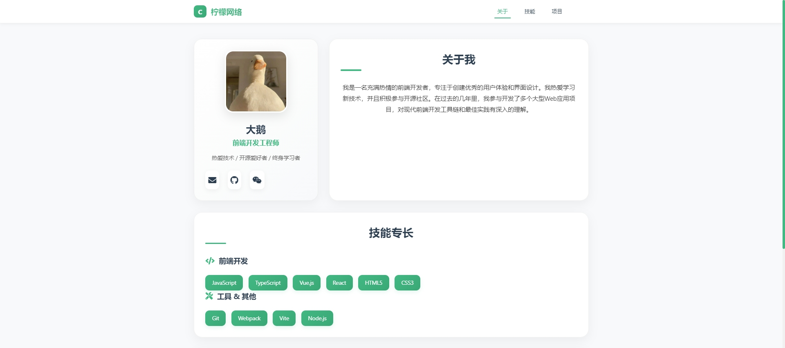
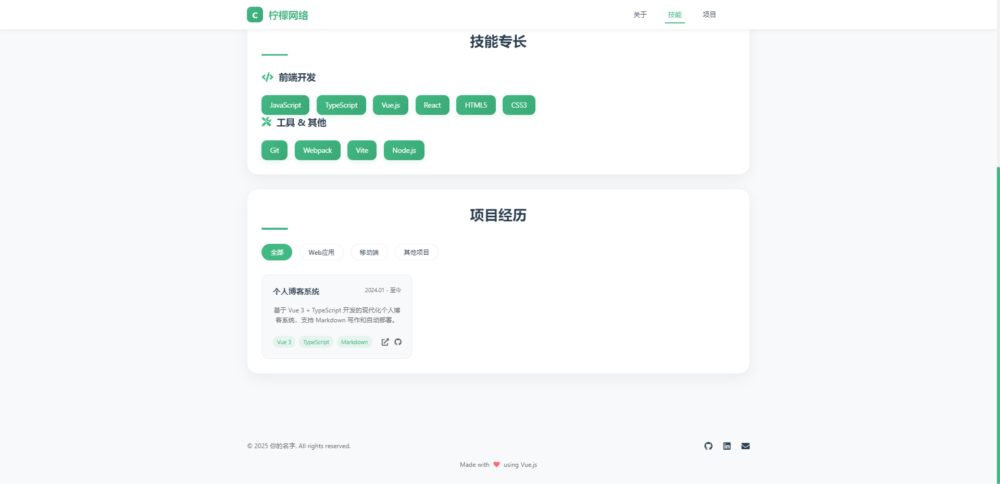

# 柠檬网络

柠檬网络是一个基于 Vue 3 和 Vite 的现代化个人网站模板，旨在展示个人信息、技能和项目经历。

 <!-- 请确保路径正确 -->

## 技术栈

- Vue 3
- Vite
- CSS
- Font Awesome

## 功能

- 个人信息展示
- 技能专长展示
- 项目经历展示
- 主题切换功能（浅色/深色模式）
- 平滑滚动导航

## 安装步骤

1. **克隆项目**

   ```bash
   git clone https://github.com/yourusername/lemon-network.git](https://github.com/yang66yang/lemon-network.git
   cd lemon-network
   ```

2. **安装依赖**

   ```bash
   npm install
   ```

3. **启动开发服务器**

   ```bash
   npm run dev
   ```

4. **打开浏览器**

   在浏览器中访问 `http://localhost:5173`。

## 使用说明

- 在 `src/views/Home.vue` 中编辑个人信息、技能和项目经历。
- 在 `src/components/Header.vue` 中修改导航链接。
- 使用 `src/composables/useTheme.js` 来管理主题切换。

## 截图

以下是项目的界面截图：

 <!-- 请确保路径正确 -->
 <!-- 请确保路径正确 -->


## 贡献

欢迎任何形式的贡献！请提交问题或拉取请求。

## 许可证

此项目采用 MIT 许可证，详情请查看 [LICENSE](LICENSE) 文件。

## 联系

如有问题，请联系：

- 邮箱: dae123ll@163.com
- GitHub: [yang66yang](https://github.com/yang66yang)

# Vue 3 + Vite

This template should help get you started developing with Vue 3 in Vite. The template uses Vue 3 `<script setup>` SFCs, check out the [script setup docs](https://v3.vuejs.org/api/sfc-script-setup.html#sfc-script-setup) to learn more.

Learn more about IDE Support for Vue in the [Vue Docs Scaling up Guide](https://vuejs.org/guide/scaling-up/tooling.html#ide-support).
